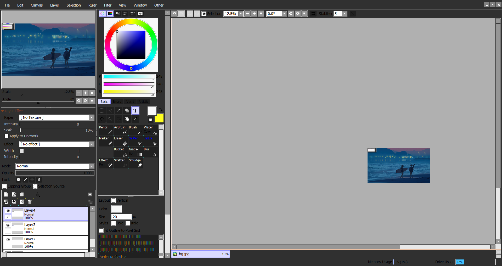

2085392 = .data header begins ... nvm old ver that one was.
Probably pallete:

    C0C0C0
    FF3050 
    D0D0D0
    204080
    E0E0E0
    F8F8F8
    90B0E8

    808080

    0800F9 FF?
    E9FFE9 FF?
    0100E9 FF?

sai2 2024 02 02:

00341290 FFFFFF susupicous

где-то между 0x341060 и 0x500000 у меня обводка у пары кнопок покрасилась. это #C0C0C0.

### [ C0C0C0 ] неактивный текст
0x001BC95B
### ==

### [ C0C0C0 ] фон неактивного канваса и его маленькая версия слева сверху. 
0x00534688
### ==

### [ B0B0B0 ] фон за слоями, как активный, так и неактивный
0x0053468C
### ==

### [ B0B0B0 ] фон активного канваса (визуальных багов не обнаружено, если менять все 4 зависимости)
0x0018838B
0x001880AC
0x0018A004
0x0001AE93
### ==

### [ F8F8F8 ] основная рамка приложения
0x00534678 
0x0053467C ( не знаю на что влияет, но тот же цвет )
### ==

### [ E0E0E0 ] рамка вокруг кистей
0x00534680
### ==

### [ D0D0D0 ] некий разделитель у слоев и инструментов кистей
0x00534684
### ==

### [ 000000 ] цвет текста у панельки сверху ( файл, создать, фильтр, вид и тд. )
0x00534A98 - idle ( не нажато )
0x00534AA0 - если навести 
0x00534AA8 - если в фокусе
### ==

### [ F8F8F8 ] цвет самой панельки сверху ( файл, создать, фильтр, вид и тд. )
0x005349D0
### ==

### [ 000000 ] цвет текста у контекстовых окон
0x00534C18 - idle ( не нажато )
0x00534C20 - если навести
0x00534C28 - если нажать
### ==

### [ F8F8F8 ] цвет самих контекстовых окон
0x00534B60
### ==

### [ F8F8F8 ] цвет обводки слайдеров
0x00534ED8 - горизонтальных

0x00535018 - вертикальных
0x00535068 - верхняя стрелка слайдера
0x005350C0 - нижняя стрелка слайдера

### ==

### [ F8F8F8 ] цвет ресайзера (правый низ)
0x00535280
### ==

### [ F8F8F8 ] штуки, за которые габариты вкладок меняют
0x00535CD8 - горизонтальная
0x00535E28 - вертикальная
0x00536DF0 - цвет.. вертикальной палочки по середине??
### ==

### [ F8F8F8 ] когда есть вкладки где-то а за ними фон, вот это цвет фона (например при открытии файла Folder tree, Bookmark tree)
0x005370D0
### ==

### [ F8F8F8 ] scale & angle под мини канвасом (баблквасом)
0x00536C00
### ==

-
### [ FFFFFF ] фон НЕактивных слайдеров (и ещё фон некоторых закрытых активных списков)
0x0031B4B8
### ==

### [ FFFFFF ] фон активных слайдеров
0x0031B498 - idle
0x0031B49C - hovered / focused
### ==

### [ C0C0C0 ] цвет слайдеров
0x0031B4C0
### ==

-
### [ FFFFFF ] обводка элементов внутри списка в меню выбора файла. фон в bookmark
0x003709B0
### ==

### [ FFFFFF ] кнопки справа сверху у окон
0x00535568 - свернуть
0x00535590 - весь экран
0x005355E0 - закрыть
### ==

### [ FFFFFF ] фон радиокнопок
0x0053644C
### ==

### [ 000000 ] цвет текста file open menu
0x00370A40 - в списке 
0x00370B30 - у плиток файлов
### ==

### [ 000000 ] цвет текста у кистей
0x00370760
### ==

### [ FFFFFF(FF)* ] фон у кистей + фон у элементов интерфейса в file menu + фон скролл элементов в контекстных меню со слайдером
0x004D1038 - 0x004D1C33

* Тут важно все 4 канала одинаковыми делать, чтобы избежать артефактов.
### ==

0x00340000 <..> 0x005449FF цвет радиокнопок, кнопок окон (закрыть, свернуть..), кнопок у слоев (скрыть слой...)

section / .srclibs - FF FF FF FF цвет фона кистей, элементов интерфейса. надо менять все 4 байта на один цвет, чтобы не было артефактов.
section / .appskin - 00 00 00 00 тут есть цвет текста кистей и текста элементов интерфейса (в выборе файла например список). 

0x0036E400 <..> 0x003763FF - цвет текста в open file и у кнопок кистей

### это реально очень много последовательностей, который судя по всему внатуре только на кнопки влияют, так что тут надо сделать штуку как чел делал с поиском и заменой. всё это я меняю на primary color, чтобы обводка отделяла все эти элементы на основном фоне. получается, что primary color, который задумывался изначально для фона используется для обводки элементов, чтобы отделить их от этого фона хдд но вообще темная обводка не очень, можно попробовать в принципе и наоборот её светлее основного фона сделать. НУЖНА ПРОВЕРКА НА НАЛИЧИЕ АРТЕФАКТОВ.
section / .srclibs - F2 F2 F2 00 обводка некоторых кнопок.
section / .srclibs - F4 F4 F4 00 часть обводки некоторых кнопок.
section / .srclibs - E4 E4 E4 00 часть обводки некоторых кнопок. ЕСТЬ АРТЕФАКТЫ!
section / .srclibs - E0 E0 E0 00 часть обводки некоторых кнопок.
section / .srclibs - E8 E8 E8 00 часть обводки некоторых кнопок + задний фон слайдеров, которые прокрутки
section / .srclibs - F0 F0 F0 00 задний фон неактивных слайдеров, которые прокрутки
section / .srclibs - F8 F8 F8 00 замена этого поменяла цвета "квадратов у радиокнопок" + заливку у всех других маленьких кнопок. ЕСТЬ ЗНАЧИТЕЛЬНЫЕ АРТЕФАКТЫ! ( ниже есть фикс )
section / .srclibs - DA DA DA 00 часть обводки у слайдеров и кнопок...блять
###

### НУЖНА ПРОВЕРКА НА НАЛИЧИЕ АРТЕФАКТОВ.
section / .appskin - F0 F0 F0 F0 пустые клетки у кистей.
###

section / .appskin - F8 F8 F8 F8 это фон цветового круга, но он баганый ппц

### F8 F8 F8 00 заливка у всех маленьких кнопок (нет фона радиокнопок, как раньше, см. много последовательностей)
0x004E0C80 < .. > 0x004F16DF
###

по поводу section / .srclibs - E4 E4 E4 00 : 
    тут короче если брать последовательности 0x004D1000 < .. > 0x004F16DF, то не всё красится, но зато нет артефактов. может быть её расширить просто немного по нижней границе и нормально будет. в целом кстати этот диапазон не трогает окно настроек, оно белое, что круто, лучше пусть таким и будет. ещё бы блин списки не красить внутри этого меню, а то бесит, что они темные, а всё остальное белое. так хоть не придется искать, как фон за ними красить.

section / .srclibs - F8 F8 F8 F8 тут есть цвет оставшихся кнопок интерфейса и некоторые обводки слайдеров и списков. ЕСТЬ АРТЕФАКТЫ.

4DD400 - 4FC2AF чот вроде норм тут да остатки красятся F8 F8 F8 F8

### F8 F8 F8 00
52FD70 - 53E3FF пак кнопок, артефактов нет, но.. без фона радиокнопок и судя по всему слайдеры под цветовым кругом без изменений. скрин ниже
###

~~0x0035F750 - 0x003E3E9F всё залить нахрен без пробелов одним цветом~~ (не получилось :d)

4A3FAF 4A3FAF

в appskin где-то есть цвет точки радиокнопки между 340000 и 36e7df

### 00 00 00 00 текст вкладкок кистей + текст кистей
0x003706D0
###

### 00 00 00 00 текст размеров кистей (текст под черными кружочками)
0x00370900
###

### FF 00 00 текст каких-то синих кистей, зачем почему саи, ты гей.
0x00370768
###

FF DB DB FF
80 80 FF 80
80 FF CF CF
80 FF 80 80
FF 80 80 FF
DB DB FF D3
D3 D3 FF DB
DB FF DB DB
D3 FF 80 80

30FFFF

FFFF30

3B13DF